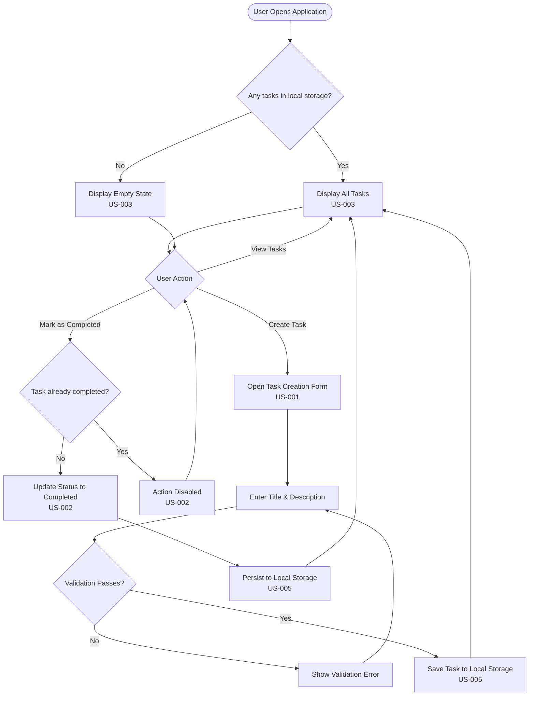

# Task Tracker Application — BA Analysis

---

## Phase 1 — Requirement Analysis

### Functional Requirements

| ID | Requirement |
|----|-------------|
| FR-01 | Users can create tasks |
| FR-02 | Users can mark tasks as completed |
| FR-03 | Users can view all tasks |
| FR-04 | Each task has: title, description, status |

### Non-Functional Requirements

| ID | Requirement |
|----|-------------|
| NFR-01 | Simple UI |
| NFR-02 | Local storage (no database required) |
| NFR-03 | Should be lightweight |

### Gaps & Ambiguities Identified

- No mention of task editing or deletion.
- No defined list of allowed statuses beyond "completed" (e.g., is there a "pending" / "in progress"?).
- "Simple UI" is subjective — no specific UX constraints provided.
- "Lightweight" is not quantified (e.g., load time, bundle size, memory footprint).
- No mention of user authentication or multi-user support.
- No specification of which local storage mechanism (localStorage, file system, IndexedDB, etc.).
- No mention of task ordering or sorting.

---

## Phase 2 — User Stories

---

### US-001 — Create a Task

| Field | Content |
|-------|---------|
| **US-ID** | US-001 |
| **Name** | Create a Task |
| **Description** | _As a user, I want to create a new task with a title, description, and status, so that I can track work I need to do._ |

**Rule-Based Use-Case Scenario:**

```
Use Case: Create a Task
Primary Actor: User
Preconditions: The application is open and the task creation form is accessible.
Trigger: The user initiates the "Create Task" action.

Main Success Scenario:
  1. The user navigates to the task creation form.
  2. The user enters a title (non-empty, non-whitespace-only string).
  3. The user enters a description (non-empty, non-whitespace-only string).
  4. The system assigns a default status to the task (see BR-002).
  5. The system validates that title and description are not empty or whitespace-only (see BR-001).
  6. The system persists the task to local storage.
  7. The system confirms successful task creation.
  8. The newly created task appears in the task list.

Alternative Flows:
  5a. Title is empty or whitespace-only → System displays a validation error; task is not created.
  5b. Description is empty or whitespace-only → System displays a validation error; task is not created.
  6a. Local storage is full or unavailable → System displays an error message.

Postconditions: A new task exists in local storage with the provided title, description, and a default status.
```

**Edge Cases:**
- User submits title/description consisting only of whitespace.
- Extremely long title or description values.
- Local storage quota exceeded.
- Duplicate task titles (is this allowed?).

**Open Questions:** OQ-001 (max length?), OQ-002 (user sets initial status?), OQ-003 (duplicate titles?)

---

### US-002 — Mark a Task as Completed

| Field | Content |
|-------|---------|
| **US-ID** | US-002 |
| **Name** | Mark a Task as Completed |
| **Description** | _As a user, I want to mark an existing task as completed, so that I can track which work is done._ |

**Rule-Based Use-Case Scenario:**

```
Use Case: Mark a Task as Completed
Primary Actor: User
Preconditions: At least one task exists that is not already "Completed".
Trigger: The user selects "Mark as Completed" on a task.

Main Success Scenario:
  1. The user views the task list.
  2. The user selects a non-completed task.
  3. The user triggers "Mark as Completed".
  4. The system changes status to "Completed" (see BR-003).
  5. The system persists the update to local storage.
  6. The UI reflects the updated status.

Alternative Flows:
  2a. Task is already completed → Action is disabled/hidden (see BR-004).
  5a. Local storage write fails → Error displayed; status unchanged.

Postconditions: The selected task's status is "Completed".
```

**Edge Cases:**
- Already-completed task re-completion attempt.
- Race condition across multiple browser tabs.

**Open Questions:** OQ-004 (revert completed status?), OQ-005 (visual differentiation?)

---

### US-003 — View All Tasks

| Field | Content |
|-------|---------|
| **US-ID** | US-003 |
| **Name** | View All Tasks |
| **Description** | _As a user, I want to view all tasks in a list, so that I can see an overview of all work items and their statuses._ |

**Rule-Based Use-Case Scenario:**

```
Use Case: View All Tasks
Primary Actor: User
Preconditions: The application is open.
Trigger: The user navigates to the task list view.

Main Success Scenario:
  1. The user opens the task list.
  2. The system retrieves all tasks from local storage.
  3. The system displays all tasks showing title, description, and status.

Alternative Flows:
  2a. No tasks exist → Display empty state message.
  2b. Local storage unavailable/corrupt → Display error message.

Postconditions: The user sees a complete list of all tasks.
```

**Edge Cases:**
- Zero tasks (empty state).
- Very large number of tasks.
- Corrupted storage data.

**Open Questions:** OQ-006 (sort order?), OQ-007 (pagination?), OQ-008 (filtering/search?)

---

### US-004 — Simple User Interface

| Field | Content |
|-------|---------|
| **US-ID** | US-004 |
| **Name** | Simple User Interface |
| **Description** | _As a user, I want a simple and intuitive UI, so that I can manage tasks without a learning curve._ |

**Rule-Based Use-Case Scenario:**

```
Use Case: Simple User Interface
Primary Actor: User
Preconditions: The application is deployed and accessible.
Trigger: The user opens the application.

Main Success Scenario:
  1. The user opens the application.
  2. The system presents a clean, uncluttered interface.
  3. The primary actions (create task, view tasks, mark as completed) are discoverable without instructions.
  4. The interface uses a minimal number of screens/views (see BR-005).
  5. The user can accomplish any core task within a minimal number of clicks/interactions.

Alternative Flows:
  (None — this is a quality-attribute constraint.)

Postconditions: The user can navigate and use all features with minimal effort and no external documentation.
```

**Edge Cases:**
- Accessibility: screen readers, keyboard-only navigation.
- Responsiveness on various screen sizes / devices.

**Open Questions:** OQ-009 (UI framework?), OQ-010 (mobile-friendly?), OQ-011 (WCAG compliance?)

---

### US-005 — Local Storage Persistence

| Field | Content |
|-------|---------|
| **US-ID** | US-005 |
| **Name** | Local Storage Persistence |
| **Description** | _As a user, I want my tasks stored locally without a database, so that the app works offline and without server infrastructure._ |

**Rule-Based Use-Case Scenario:**

```
Use Case: Local Storage Persistence
Primary Actor: System
Preconditions: The user's browser/environment supports local storage.
Trigger: Any task creation or status update action is performed.

Main Success Scenario:
  1. The user creates or updates a task.
  2. The system serializes the task data.
  3. The system writes the data to local storage (see BR-006).
  4. On subsequent application loads, the system reads and deserializes task data from local storage.
  5. All previously saved tasks are available.

Alternative Flows:
  3a. Local storage is full → System notifies the user that storage is full.
  3b. Local storage is disabled or unavailable → System notifies the user that persistence is unavailable.
  4a. Stored data is corrupt or unparseable → System displays an error and optionally offers to reset.

Postconditions: Task data persists across browser sessions without a backend database.
```

**Edge Cases:**
- User clears browser data / local storage manually.
- Local storage quota exceeded (~5 MB typical limit).
- Multiple browser tabs open simultaneously causing read/write conflicts.
- Private/incognito mode with restricted storage.

**Open Questions:** OQ-012 (which mechanism?), OQ-013 (quota handling?), OQ-014 (export/import?)

---

### US-006 — Lightweight Application

| Field | Content |
|-------|---------|
| **US-ID** | US-006 |
| **Name** | Lightweight Application |
| **Description** | _As a user, I want the application to be lightweight, so that it loads quickly and consumes minimal resources._ |

**Rule-Based Use-Case Scenario:**

```
Use Case: Lightweight Application
Primary Actor: User
Preconditions: The application is deployed.
Trigger: The user opens or interacts with the application.

Main Success Scenario:
  1. The user opens the application.
  2. The application loads within an acceptable time frame (see BR-007).
  3. The application uses minimal external dependencies.
  4. The application consumes minimal memory and CPU during use.
  5. The user experiences smooth, lag-free interactions.

Alternative Flows:
  2a. On a slow connection or device, the application still loads within a reasonable time due to small bundle size.

Postconditions: The application remains responsive and resource-efficient during all interactions.
```

**Edge Cases:**
- Very low-end devices or slow network connections.
- Large number of tasks impacting rendering performance.

**Open Questions:** OQ-015 (performance targets?), OQ-016 (max dependencies?), OQ-017 (target environment?)

---

## Phase 2.5 — Business Rules

| Rule ID | Rule | Applies To |
|---------|------|------------|
| BR-001 | Title and description are mandatory; must not be empty or whitespace-only. | US-001 |
| BR-002 | New tasks get a default status (e.g., "Pending") automatically. | US-001 |
| BR-003 | Only defined status transition: non-completed → "Completed". | US-002 |
| BR-004 | Already-completed tasks cannot be marked completed again (action disabled/hidden). | US-002 |
| BR-005 | All core actions must be accessible without nested navigation. | US-004 |
| BR-006 | All task data must persist to client-side local storage; no server DB. | US-001, US-002, US-005 |
| BR-007 | Minimize external dependencies and total bundle size. | US-006 |
| BR-008 | Each task contains exactly three fields: title, description, status. | US-001, US-003 |
| BR-009 | Task list must display all three fields for every task. | US-003 |

---

## Phase 3 — Dependencies & Process Diagram

### Dependencies

| Dependency | Relationship |
|------------|-------------|
| US-002 → US-001 | Tasks must exist before marking complete |
| US-003 → US-001 | Tasks must exist to be displayed |
| US-001 → US-005 | Creation requires local storage persistence |
| US-002 → US-005 | Status updates require local storage persistence |
| US-003 → US-005 | Viewing requires reading from local storage |
| US-004 | Cross-cutting: applies to US-001, US-002, US-003 |
| US-006 | Cross-cutting: applies to entire application |

### Mermaid Process Diagram



### Draw.io-Compatible Flow

**Nodes:**

| ID | Label | Type |
|----|-------|------|
| N1 | User Opens Application | Start (Stadium) |
| N2 | Any tasks in local storage? | Decision (Diamond) |
| N3 | Display All Tasks (US-003) | Process (Rectangle) |
| N4 | Display Empty State (US-003) | Process (Rectangle) |
| N5 | User Action | Decision (Diamond) |
| N6 | Open Task Creation Form (US-001) | Process (Rectangle) |
| N7 | Enter Title & Description | Process (Rectangle) |
| N8 | Validation Passes? | Decision (Diamond) |
| N9 | Show Validation Error | Process (Rectangle) |
| N10 | Save Task to Local Storage (US-005) | Process (Rectangle) |
| N11 | Task already completed? | Decision (Diamond) |
| N12 | Action Disabled (US-002) | Process (Rectangle) |
| N13 | Update Status to Completed (US-002) | Process (Rectangle) |
| N14 | Persist to Local Storage (US-005) | Process (Rectangle) |

**Edges:**

| From | To | Condition |
|------|----|-----------|
| N1 | N2 | — |
| N2 | N3 | Yes |
| N2 | N4 | No |
| N3 | N5 | — |
| N4 | N5 | — |
| N5 | N6 | Create Task |
| N5 | N11 | Mark as Completed |
| N5 | N3 | View Tasks |
| N6 | N7 | — |
| N7 | N8 | — |
| N8 | N9 | No |
| N8 | N10 | Yes |
| N9 | N7 | — |
| N10 | N3 | — |
| N11 | N12 | Yes |
| N11 | N13 | No |
| N12 | N5 | — |
| N13 | N14 | — |
| N14 | N3 | — |

---

## Open Questions Summary

| OQ-ID | Question | Story |
|-------|----------|-------|
| OQ-001 | Max length for title/description? | US-001 |
| OQ-002 | User sets initial status, or always defaulted? | US-001 |
| OQ-003 | Are duplicate task titles permitted? | US-001 |
| OQ-004 | Can a completed task be reverted? | US-002 |
| OQ-005 | Visual differentiation for completed tasks? | US-002 |
| OQ-006 | Display order for tasks? | US-003 |
| OQ-007 | Pagination/infinite scroll needed? | US-003 |
| OQ-008 | Filtering/search capabilities? | US-003 |
| OQ-009 | UI framework preferences? | US-004 |
| OQ-010 | Must UI be responsive/mobile-friendly? | US-004 |
| OQ-011 | Accessibility requirements (WCAG)? | US-004 |
| OQ-012 | Which local storage mechanism? | US-005 |
| OQ-013 | Handle storage quota limits gracefully? | US-005 |
| OQ-014 | Data export/import needed? | US-005 |
| OQ-015 | Specific performance targets? | US-006 |
| OQ-016 | Max external dependencies? | US-006 |
| OQ-017 | Target environment (web, desktop, other)? | US-006 |
